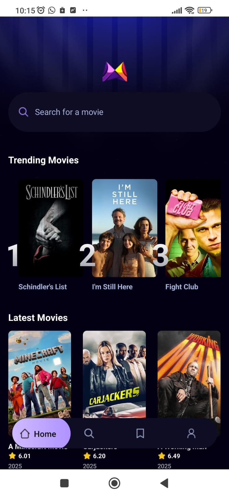
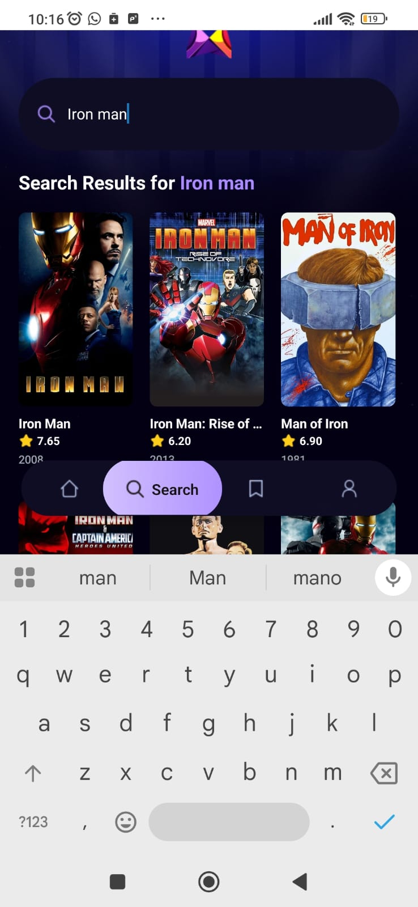
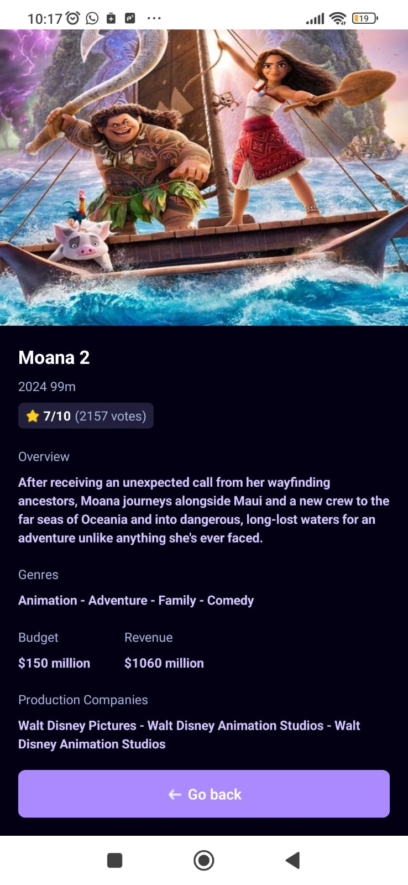

# Movie App 🎬

Este é um aplicativo de filmes que mostra os filmes mais populares, permite buscar qualquer filme e exibe detalhes sobre os filmes selecionados.

## Funcionalidades 🚀

- **Tela Inicial**: Mostra os **Trending Movies**, que são os filmes mais pesquisados pelos usuários, e os **Latest Movies** (últimos filmes disponíveis na API TMDB). Além disso, há um campo de busca para procurar por qualquer filme.
- **Busca de Filmes**: Uma página dedicada onde é possível buscar filmes por título.
- **Detalhes do Filme**: Uma página com mais informações sobre o filme selecionado, incluindo resumo, faturamento, data de lançamento e mais.

### Navegação 🧭

- **Página Inicial**: Contém filmes populares, recentes e o campo de busca.
- **Busca**: Digite o título de um filme e veja os resultados.
- **Detalhes do Filme**: Explore mais detalhes sobre o filme clicado.

## Instalação 🛠️

Para instalar o app no seu dispositivo, siga os passos abaixo:

1. Clone o repositório:
   ```bash
   git clone https://github.com/seu-usuario/movie-app.git
   ```
2. Navegue até a pasta do projeto:
   ```bash
   cd movie-app
   ```
3. Instale as dependências:
   ```bash
   npm install
   ```
4. Inicie o app:
   ```bash
   npm start
   ```
   Ou, se estiver usando o Expo:
   ```bash
   expo start
   ```

## Demonstração 🎥

Aqui estão algumas imagens para mostrar como o aplicativo se parece:

<div style="display: flex; justify-content: space-between; gap: 10px;">

   <div>

   #### Tela inicial 📱

   
   </div>
   <div>

   #### Busca de Filmes 🔎

   
   </div>
   <div>

   #### Detalhes do Filme 🎦

   
   </div>
</div>


## Tecnologias Usadas 💻

- **React Native**: Framework para construir o app.
- **NativeWind**: Framework para estilizar o app.
- **Expo**: Plataforma para facilitar o desenvolvimento com React Native.
- **AppWrite**: Backend para gerenciar dados.
- **TMDB API**: Para buscar filmes e informações.

## Contribua 💬

Sinta-se à vontade para contribuir com melhorias! Você pode:

- Reportar bugs
- Sugerir ou implementar novas funcionalidades (saved ou profile)
- Melhorar a documentação

### Para Contribuir:

1. Faça um Fork deste repositório.
2. Crie uma branch para a sua feature (`git checkout -b minha-feature`).
3. Faça as modificações e commit (`git commit -am 'Adicionando uma nova feature'`).
4. Envie as modificações para o seu repositório (`git push origin minha-feature`).
5. Crie um Pull Request.

## Redes Sociais 📲

- [Instagram](https://www.instagram.com/thiagopaulista87/) 📸
- [LinkedIn](https://www.linkedin.com/in/thiago-alves-dev/) 💼
- [GitHub](https://github.com/Thiago87dev) 🖥️

Agradeço por usar meu app! 😃
